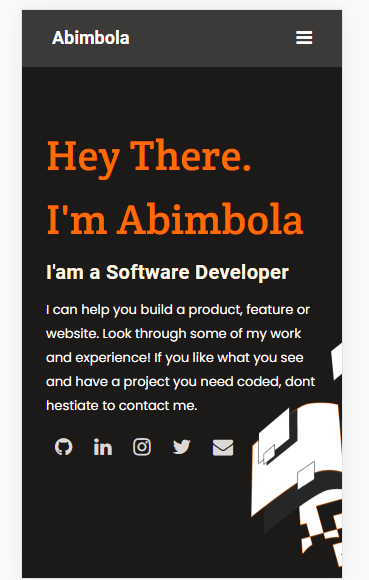

# PORTFOLIO-PROJECT

> This project is a Microverse exercise on HTML and CSS that demonstrates the knowledge of Semantic HTML, flexbox, background properties, and mobile-first responsiveness

## Built With

- Semantic HTML & CSS
- Github workflow
- Linters(Lighthouse, stylelint, Webhint)

## Live Preview 

[Live Demo Link](https://deploy-preview-1--bimbola-mv-portfolio.netlify.app/)

## Author

👤 **Abimbola**

- GitHub: [bimbolabuari](https://github.com/bimbolabuari)
- Twitter: [bimbolabuari](https://twitter.com/bimbolabuari)
- LinkedIn: [bimbolabuari](https://linkedin.com/in/bimbolabuari)

## 🤝 Contributing

Contributions, issues, and feature requests are welcome!

Feel free to check the [issues page](../../issues/).

## Show your support

Give a ⭐️ if you like this project!

## Acknowledgments

- Microverse
- [Figma](https://www.figma.com/file/l7SqJ3ZfkAKih9sFxvWSR4/Microverse-Student-Project-1?node-id=1%3A1471)
- Code reviewer(s).

## 📝 License

[MIT licensed](./LICENSE).